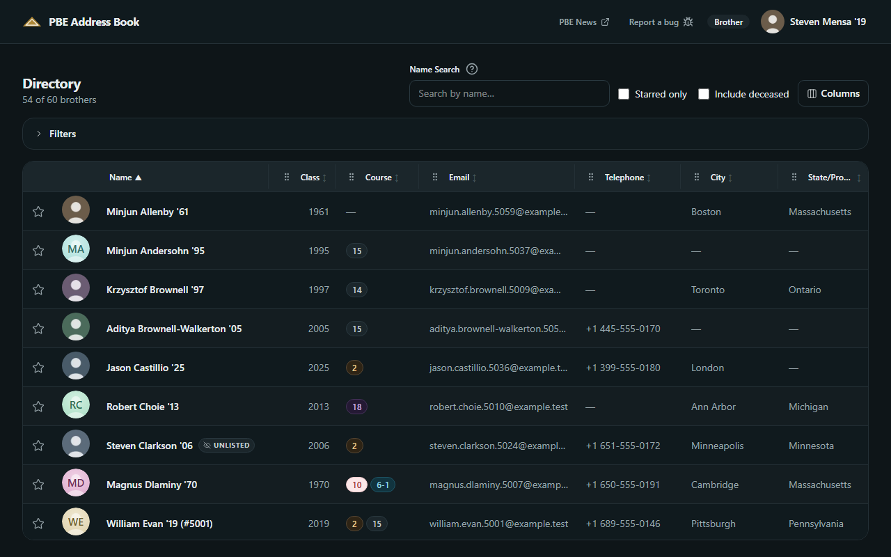
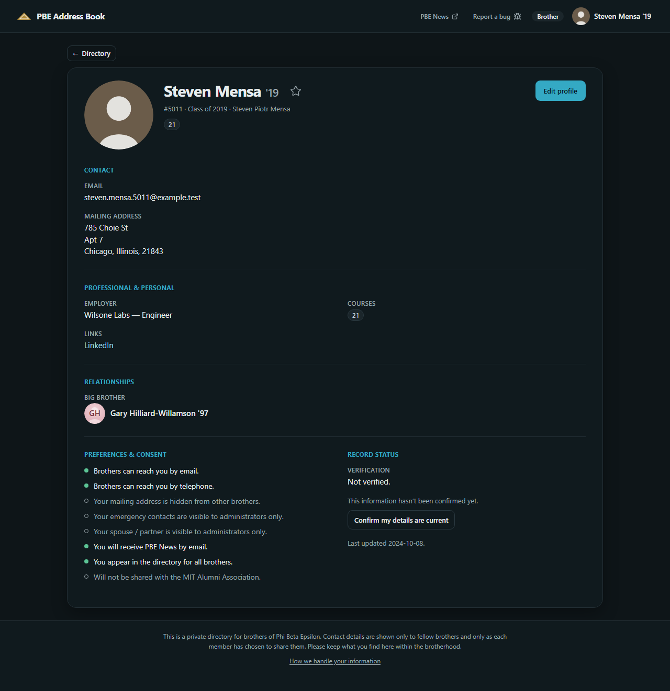
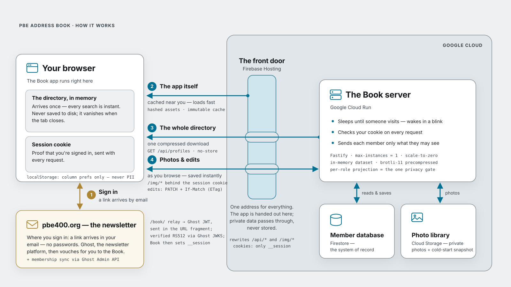

# PBE Address Book ("Book")

[](https://github.com/fthiess/pbe-address-book/actions/workflows/ci.yml)

A members-only directory for the brothers of PBE — a sibling to the Ghost
newsletter site at `pbe400.org`, to live at `book.pbe400.org`.

This repository is a TypeScript monorepo. It is being built phase by phase per
[`docs/initial-build/CODING-PROJECT-PLAN.md`](docs/initial-build/CODING-PROJECT-PLAN.md);
the design is settled in the companion docs (PRD, database schema, engineering
design, API spec) and the decision log
([`docs/initial-build/DECISIONS.md`](docs/initial-build/DECISIONS.md)) is
authoritative for *why* anything is the way it is.

**Project status & roadmap.** Development is tracked ticket by ticket in Linear
(project *PBE-Book*, not publicly viewable). The phased roadmap lives in
[`CODING-PROJECT-PLAN.md`](docs/initial-build/CODING-PROJECT-PLAN.md), and how
each phase actually landed is recorded in the decision log's `N`-notes
([`DECISIONS.md`](docs/initial-build/DECISIONS.md)).

## What it looks like

The **Directory** — every brother, searchable and sortable, with the columns
each member chooses for himself:



A **brother's profile** — showing only what he has chosen to share, enforced on
the server rather than hidden in the browser:



Both are captured from the real production bundle against fake data by
`npm run docs:screenshots` (see [`docs/images/`](docs/images/README.md)).

## Architecture

<picture>
  <source media="(prefers-color-scheme: dark)" srcset="docs/architecture/book-arch-readme-dark.svg">
  
</picture>

Four flows, keyed to the numbers in the diagram:

1. **Sign in** rides the Ghost newsletter site: a magic-link email, then the
   `/book/` relay hands a short-lived Ghost JWT to Book's `/auth/callback` in
   the URL fragment; Book verifies it (RS512, against Ghost's JWKS) and sets
   its own `__session` cookie (D20/D104).
2. **The app itself** is content-hashed static assets served from Firebase
   Hosting's edge cache (`Cache-Control: immutable`); only the app shell is
   ever edge-cached (D73).
3. **The whole directory** arrives as one brotli-compressed
   `GET /api/profiles`, projected per role on the server — the single
   privacy-enforcement point — and served `no-store`: member data lives only
   in tab memory, never on disk (D82/D84/D95).
4. **Photos & edits**: images are app-served from a private bucket behind the
   session cookie (`/img/*` — deliberately no CDN in front of member data,
   D126); edits write through to Firestore with optimistic concurrency
   (`If-Match`, D25).

Firebase Hosting is the single origin — `/api/*` and `/img/*` rewrite to a
deliberately single-instance, scale-to-zero Cloud Run service (D83) that
hydrates its in-memory dataset from a GCS snapshot on cold start (D85). The
full picture is [`ENGINEERING-DESIGN.md`](docs/initial-build/ENGINEERING-DESIGN.md)
§1; the diagram sources (plus plain-English slide variants) live in
[`docs/architecture/`](docs/architecture/README.md).

## Layout

| Path | Contents |
|---|---|
| `apps/web/` | The React + Vite SPA (shadcn/ui on Tailwind v4). |
| `apps/api/` | The Node + TypeScript backend (Fastify, esbuild-bundled) on Cloud Run. |
| `packages/shared/` | Types and the shared client/server validation module (the one `Profile` type), capabilities, canonical names, vocabularies. |
| `packages/help-content/` | The single-source in-page help / manual entries. |
| `tools/fake-data/` | The deterministic seeded fake-data generator (D65) + the staging seed/link scripts. |
| `tools/migration/` | One-time pre-launch migration utilities (never deployed; built in Phase 8). |
| `e2e/` | The Playwright end-to-end suite (including the axe WCAG 2.2 AA scans). |
| `scripts/` | The CI gate guards: no-dev-provider, no-session-replay, tokens-in-sync, bundle-size, CSP hashes, CI timing. |
| `infra/` | Staging provisioning + Workload Identity Federation setup scripts, and the environment notes. |
| `ghost-bridge/` | Reference mirror of the Ghost-side relay (`book.hbs` + routes snippet); the deployment home is the `pbe-news-ghost-theme` repo — keep the two in sync. |
| `docs/` | Design and build documentation, by build. The initial release lives in `docs/initial-build/`. |
| `.github/workflows/` | `ci.yml` (the tests-green gate) and `deploy-staging.yml` (deploy on merge). |

## Prerequisites

- **Node.js 24+** and npm (see `.nvmrc`).
- **A JVM (JDK 21+)** — the Firestore emulator runs on the JVM, and
  `firebase-tools` v15 requires Java 21. On Windows:
  `winget install --id Microsoft.OpenJDK.21 -e`.
- Everything else (Vite, Vitest, Playwright, the Firebase CLI) is installed
  locally via `npm install`; nothing needs to be global.

## Getting started

```bash
npm install
npx playwright install --with-deps   # one-time: download the E2E browsers

npm run check        # Biome format + lint
npm run typecheck    # tsc across every package
npm run build        # build libs, the SPA bundle, and the API bundle
npm run test         # Vitest unit/integration (non-emulator)
npm run test:emulator   # Vitest with the Firestore emulator running
npm run seed         # seed the deterministic fake dataset into the emulator
npm run e2e          # Playwright end-to-end
npm run verify:gate  # the full tests-green gate, end to end

npm run ci:timing            # per-step timing for the latest CI + deploy runs
npm run ci:timing -- --runs 10   # trend across the last 10 runs (spot pipeline regressions)
```

## Running the app locally

The SPA, the API, and the Firestore emulator run side by side. The
`DevIdentityProvider` gives a Ghost-free, role-switchable login (D72), so no
Ghost is needed locally.

```bash
# 1. Start the emulator and seed the fake dataset (leave it running):
npx firebase emulators:start --only firestore   # in its own terminal
npm run seed                                     # once, into the running emulator

# 2. Start the API against the emulator (its own terminal):
FIRESTORE_EMULATOR_HOST=127.0.0.1:8080 npm run dev --workspace apps/api

# 3. Start the SPA (its own terminal); it proxies /api and /img to the API:
npm run dev --workspace apps/web
```

Open the SPA, and on the sign-in screen use the **Local development** role
switcher (brother / manager / admin) to sign in. In production that block is
absent — only the real Ghost **Sign in** button ships (`import.meta.env.DEV`),
and the dev session route exists only in the dev API entry point (D108).

## Environments

Three environments, by design (`CODING-PROJECT-PLAN.md` §4):

- **Local** — this machine: Vite, the API, the Firestore emulator, fake data,
  the `DevIdentityProvider`.
- **Staging** — a persistent cloud Book, live at
  `https://book-staging.pbe400.org` (GCP project `pbe-book-staging`: Firebase
  Hosting → Cloud Run + Firestore + a private image bucket, provisioned by
  `infra/provision-staging.sh`). **Fake data only.** Sign-in goes through the
  real Ghost bridge against the self-hosted ghost-staging instance
  (`staging.pbe400.org`) — never production Ghost (D72).
  The Firebase default origin `pbe-book-staging.web.app` still serves the same
  site, but sign-in from it lands on the custom domain, because the bridge's
  callback allowlist names only the latter (D161).
- **Production** — `book.pbe400.org`, real data, the real Ghost integration.
  Not yet stood up; it comes up in Phase 8 (migration & cutover).

The `DevIdentityProvider` is locked out of production by four independent
layers (D108) and must never run anywhere near it.

### Measuring delivery performance (Lighthouse against staging)

Deliberately **not** a CI gate and **not** a dependency (DECISIONS D74/N134): with a
scale-to-zero backend the noise would train us to ignore it. This is the recipe to
reach for when the byte budget goes red, a UAT tester reports a slow load, a
delivery ticket needs before/after numbers, or **a new page or feature needs its
first-load cost measured** — the JS byte budget is a sum over all chunks and cannot
see the critical path (D74), so this is the only instrument that can.

Two conditions are load-bearing, or the numbers are noise: the run must be
**authenticated** (everything of interest is behind the session gate — an
unauthenticated run measures the signed-out shell), and the instance must be
**warm** (Cloud Run is `max-instances=1` with scale-to-zero, so a cold start makes
TTFB bimodal). Staging already seeds the full 1,200-profile dataset on every
deploy, so there is no loading step.

```bash
# 1. A real __session cookie: sign in to book-staging.pbe400.org, then copy the
#    value from DevTools -> Application -> Cookies. It is a credential — keep it
#    out of the repo. Write the header file somewhere temporary:
#      {"Cookie":"__session=<value>"}
# 2. Warm the instance.
curl -s -o /dev/null https://book-staging.pbe400.org/api/profiles -H "Cookie: __session=<value>"
```

`chrome-launcher` cannot spawn Chrome on this Windows setup (`spawn UNKNOWN`), so
host the browser with Playwright's Chromium and point Lighthouse at its debug port
rather than letting it launch its own:

```bash
node -e "require('playwright').chromium.launch({args:['--remote-debugging-port=9222','--no-sandbox']}).then(()=>new Promise(r=>setTimeout(r,900000)))" &
npx lighthouse@12 https://book-staging.pbe400.org/ --port=9222 \
  --extra-headers=/tmp/lh-headers.json --only-categories=performance \
  --output=json --output=html --output-path=/tmp/lh-directory
```

Lighthouse's default mobile preset already simulates **Slow 4G + 4× CPU**, which is
the intended profile. Read the output as a **findings list, not a score**, and
ignore the accessibility section — it duplicates the `@axe-core/playwright` gate,
and the real a11y work is the three-layer audit (D67/D79).

The **baseline to compare against** — the first run of this recipe, its numbers, and
the three findings it produced — is DECISIONS **N134** (7b-1). Cite that, not a
ticket: tickets close and archive, the decision log does not.

For the **composition** of that critical path rather than its timings — what is
page-exclusive versus shared, and why route code-splitting was measured and then
declined — see DECISIONS **D157**. It also records the cheap way to decompose the
bundle without adding a dependency: make each route its own dynamic-import root in
a throwaway build and read Rollup's own chunk table.

## CI/CD

Every push runs `ci.yml` — the same `verify:gate` you run locally (format,
lint, typecheck, build, unit + emulator tests, Playwright + axe, the bundle
budget, and the guard scripts). A green CI on a push to `main` triggers
`deploy-staging.yml`, which authenticates to GCP **keylessly via Workload
Identity Federation** (no service-account key exists) and deploys Hosting,
Firestore rules, and Cloud Run. Each deploy wipe-reseeds the staging profiles,
images, and tester link (the `STAGING_AUTOSEED` repo variable), so staging
never drifts from the generator. One landmine documented in
[`infra/README.md`](infra/README.md): the Firebase CLI deploy step is pinned to
**Node 20** to dodge a Node-24 undici/STS bug — don't "fix" it.

## License

The source code is released under the **MIT License** ([`LICENSE`](LICENSE)) —
you're welcome to use, modify, and redistribute it. The MIT grant covers the
**code only**. The Phi Beta Epsilon names and marks — "Phi Beta Epsilon,"
"PBE," the crest, the triangle device, and the gold leaf — and the brand-artwork
asset files that depict them are trademarks and brand assets of **Phi Beta
Epsilon Corporation**, are reserved, and are **not** licensed for reuse. See
[`TRADEMARKS.md`](TRADEMARKS.md) for the specifics.
