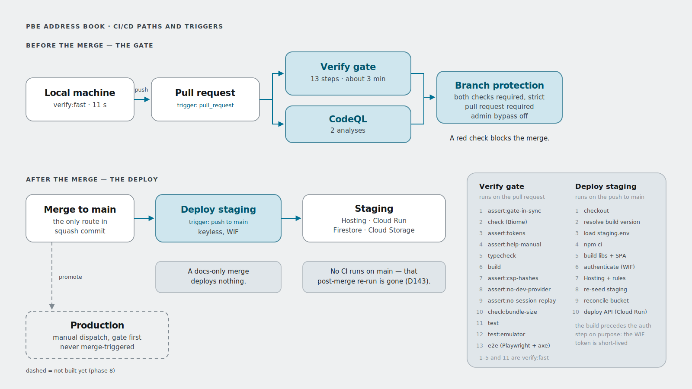

# Architecture diagrams

Hand-authored SVGs in the Book's visual-design token palette
([`tokens.css`](../initial-build/visual-design/tokens.css)), each in a light and
a dark theme:

| File | Use |
|---|---|
| `book-arch-readme-{light,dark}.svg` | Embedded in the repo README via `<picture>`; carries the monospace technical annotation layer (routes, cache directives, the `__session` cookie). |
| `book-arch-slide-{light,dark}.svg` | Plain-English version for presentations (16:9, back-of-the-room type sizes). |
| `book-cicd-{light,dark}.svg` | The delivery pipeline — paths, triggers and steps. Embedded below. No slide variant: this one is a developer reference, not something presented. |

Reading conventions for the architecture pair: **teal** marks Book data flows,
**crest gold** the Ghost identity lane, and the "front door" wall is Firebase
Hosting as the single origin — flow ② is served *at* the door (the edge-cached
app shell), flows ③/④ pass *through* it uncached (member data is `no-store`,
D95/D126). The numbered chips ①–④ order the flows for narration.

## The CI/CD pipeline

<picture>
  <source media="(prefers-color-scheme: dark)" srcset="book-cicd-dark.svg">
  
</picture>

The CI/CD diagram keeps **teal** for the active pipeline but has no gold lane —
there is no Ghost involvement in delivery. **Dashed** means *not built yet*
(the production path, phase 8). The two right-hand panels are the authoritative
step order for each workflow; the Verify gate's list is the same sequence
`verify:gate` runs locally, which is exactly what `assert:gate-in-sync`
enforces (**D141**).

The single most important thing the drawing makes visible: there is now exactly
**one** gate, and it sits *before* the merge. Everything downstream of it is
unverified by design, and is safe only because branch protection makes that one
arrow the sole route onto `main` — which is why **D143** records that
configuration as its load-bearing precondition.

Fonts follow the app's own stack (Inter with system fallback — nothing is
embedded, matching the app's own byte-frugality; text metrics were laid out
with margin so common system fonts don't overflow).

To export a high-resolution PNG for a slide deck (from this directory):

```bash
npx playwright screenshot --viewport-size=3200,1800 \
  "file://$PWD/book-arch-slide-light.svg" book-arch-slide-light@2x.png
```

When the architecture changes, edit the SVGs directly (they are plain,
commented XML with a small CSS class block per theme) and keep all four
architecture variants in step; the layout geometry is shared, the annotation
layer is the only difference between the slide and readme pairs. **The CI/CD
pair carries the same obligation:** any change to `ci.yml`, to
`deploy-staging.yml`, to `verify:gate`, or to branch protection must be
reflected in both `book-cicd-*.svg` files, or the diagram starts lying about
the pipeline it documents.

The light variant is the source of truth for the CI/CD pair; the dark one is
the same geometry with a mapped palette, so edit light first and mirror the
change. Rationale and history: decisions **N100** (architecture pair) and
**N128** (CI/CD pair) in [`DECISIONS.md`](../initial-build/DECISIONS.md).
