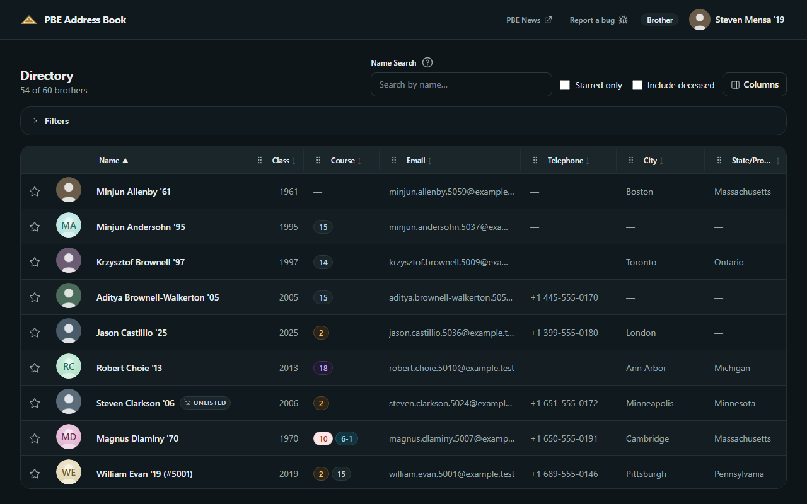
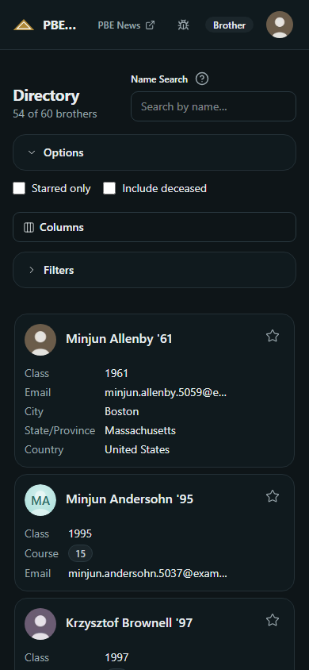
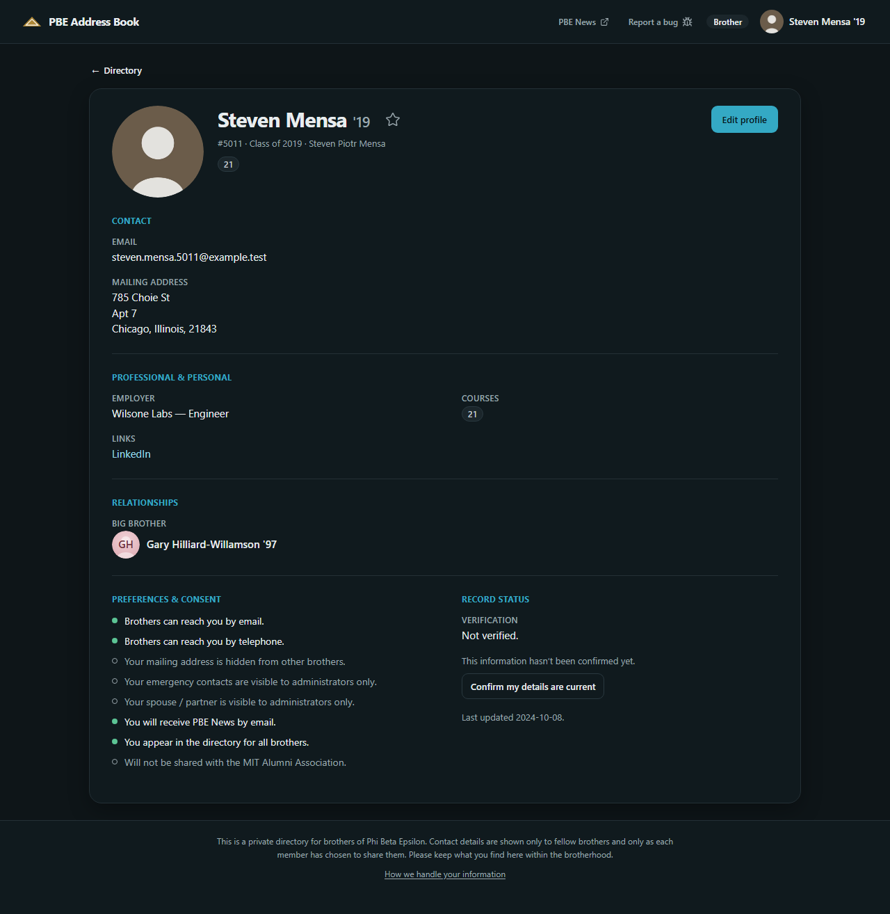
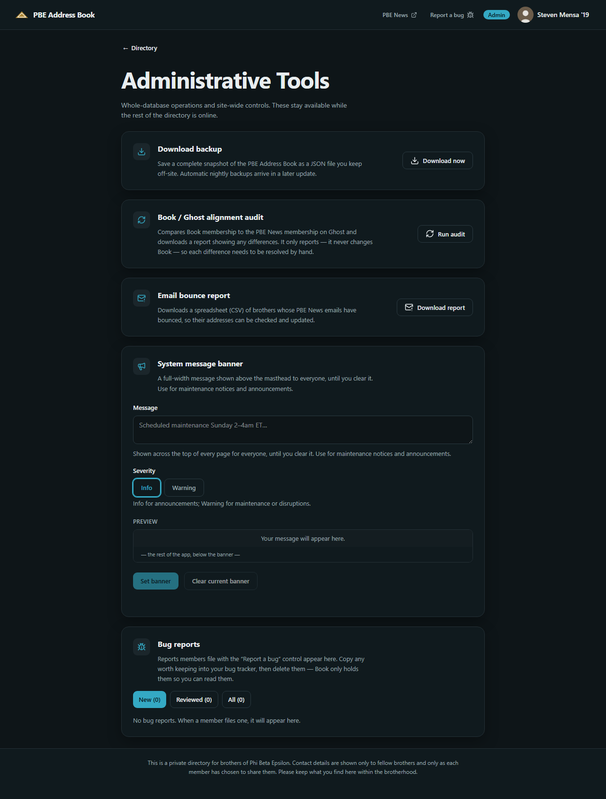

# PBE Address Book — User Manual

## 1. What the Address Book is

The **PBE Address Book** is the online address book for the brothers of Phi Beta Epsilon. It lets you look up any brother's contact information and keep your own information current. Only brothers can sign in, and the Address Book shows brothers only what each brother has chosen to share.

The Address Book is designed to be used without a manual. Wherever a control isn't obvious, the page itself explains it, right where you are working. This manual exists as a reference and a place to read about the Address Book away from the screen — but if you ever find yourself reaching for it to get ordinary things done, that's a sign we have more design work to do, and we'd like to hear about it.

A note on who it is for: the brothers of PBE range in age from as young as 18 to as old as their 90s, and reach the Address Book from devices ranging from cellphones to desktop computers, some over very slow connections and some over very fast ones. It is built with this range squarely in mind — large enough text, clear labels, full keyboard operation, a dark mode, and adjustable font sizes. If anything is hard to read or hard to operate, that is a fault in the Address Book, not a failing on your part. Let us know and we’ll try to make it better!

## 2. Getting started — signing in

You reach the Address Book through the PBE website. Sign in to `pbe400.org` the way you normally do to read PBE News, then follow the link to the Address Book. It recognizes you from your PBE website sign-in — there is no second password to remember, and no separate account to create.

**If it doesn't recognize you.** The Address Book matches you by the email address on your PBE website membership. If that email isn't on file yet, it will tell you it can't find you and ask you to contact an administrator. This usually means your current email simply hasn't been recorded yet; an administrator can add it in a moment. (PBE's records have grown over the years from several old mailing lists, so a few brothers are on file under an out-of-date address — this is the most common reason sign-in doesn't work the first time.) A small number of brothers have no email address on file at all, or have not yet been matched to a record; they cannot sign in themselves, and their information is kept current by the membership staff on their behalf.

**Staying signed in.** The Address Book keeps you signed in for a few hours and then asks you to sign in again, so that a shared or public computer doesn't stay open to your account indefinitely. When it does ask again, it tells you clearly and brings you back to sign in — and if you happen to be in the middle of editing your profile, your changes are kept while you do. You can also sign out yourself at any time: a **Sign out** control sits in the menu behind your profile icon at the top right of every page, and ends your session at once — worth using whenever you've been on a shared or public computer.

## 3. Finding brothers — the Directory

The **Directory** is the Address Book's home page: a searchable, sortable list of every brother. By default it shows living brothers, sorted by name.

**Searching by name.** The Name Search box near the top finds brothers by name. It is forgiving: it tolerates misspellings, matches names that *sound* alike, and knows common nicknames — so "Bill" finds "William" and "Tom" finds "Thomas" — letting you find a brother even if you aren't sure how his name is spelled or what he goes by formally. It searches names only — first, last, middle, and the mug (nickname) — not class years or courses; those you narrow with the filters instead.

**Filtering.** The filter panel lets you narrow the list — by class year, course, city, state or province, country, and (for managers and administrators) a few additional fields. Filters combine sensibly: choosing two courses shows brothers in *either*, while also setting a class-year range shows only brothers who match *both*. The class-year filter is more capable than it looks — it accepts single years, ranges, and lists together (for example, `1980-1989, 1992`), and ranges can be left open at either end (`1990-`, or `-1975`); the "?" beside the field explains this where you type. On a small phone screen the filters, the view options, and the column choices tuck behind a single **Options** button so the list of brothers gets the room; tap it to open them (the Name Search box always stays in view).

**Finding a manager or administrator.** A few brothers serve as the Address Book's managers and administrators — the people to contact for help, or to tell us a brother's information is out of date or that a brother has passed. The filter panel has a **Staff** setting that narrows the list to just those brothers. You can also add an optional **Role** column to the list: it shows "Manager" or "Administrator" beside those brothers and a small dash (—) for everyone else, so you can see at a glance who to reach. Both are open to every brother — staff are official points of contact, not a secret. (Your column choices are remembered, so the Role column stays off until you add it.)

**Sorting.** Click a column heading to sort by that column; click again to reverse it. Whatever you sort by, brothers with the same value fall into name order, so the list never looks arbitrary.

**Stars.** The star in each row is yours alone — a private bookmark. Star the brothers you look up often, then turn on **Starred only** to see just them. Your stars are visible only to you, and the starred view shows your starred brothers whether or not they're living.

**Brothers who have passed.** Out of respect, the Directory shows living brothers by default. Turn on **Include deceased** to see brothers who have passed; they are marked clearly, with an "In Memoriam" note, and their pages show only the information appropriate to share in memory. Where the dates are known, a brother's page shows the years he lived — for example, "1940–2024." If you have additional information that should be on a deceased brother’s profile, such as a link to an obituary, please share it with an Address Book manager or administrator so they can add it.

**Opening a brother's page.** Click a brother's name to open his full profile. As with any link, you can open it in a new browser tab if you like (the usual Ctrl-click or middle-click), and the Back button returns you to exactly where you were in the list. Once you're on a brother's page, **Prev** and **Next** at the top step you through the brothers just as they were listed — in the same order, and narrowed by whatever search, filters, and sorting you had applied — with a "12 of 431" marker so you know where you are; **← Directory** takes you back to the list, right where you left it, however far you've stepped.

## 4. Your own profile

Open your own profile from the menu behind your profile icon at the top right of every page, where it is called **My profile**. You'll see it first in **view** mode; the **Edit profile** button switches to editing. The Address Book is the one place to keep your official Phi Beta Epsilon record current — your PBE News email settings included — so a change you make here is the change everywhere.

**Editing and saving.** Edit any field, then **Save**. If you try to leave with unsaved changes, you'll be warned first. Because your email address is how you sign in, you'll also be asked to confirm before saving a change that *removes* it — clearing your email would lock you out of both the Address Book and PBE News until a new address is added. In the rare case that someone else (an administrator, say) changed your profile while you had it open, neither their change nor yours is silently overwritten — you're told what changed and given the chance to reconcile, so no edit is quietly lost.

**Your contact preferences — the switches.** Several settings on your profile are simple two-position switches, each labeled in plain words for exactly what it controls — what you will and won't receive, or who can and can't see a given piece of information. Each switch states, in plain language, what it is doing right now: "Brothers can reach you by email" when it is on, "Your email is hidden from other brothers" when it is off. So you never have to work out what flipping it would mean — the switch always describes the situation you are actually in. A few of them carry a "?" as well, where there is more worth explaining than the line itself can carry.

Most of these start in the open position — but the ones that govern sharing *beyond* the brotherhood (e.g. Share with the MIT Alumni Association), or that involve other people’s information (e.g. spouse and emergency contacts) start *off*, so that kind of sharing happens only if you deliberately turn it on.

**Whether you appear in the directory.** A switch called **Listed in the directory** governs whether other brothers can find you. Turned on — as it is for almost everyone — you appear in the Directory normally. Turned off, you remain a full member and can still sign in and still receive PBE News, but other brothers won't see you in the Directory or find you by searching. Managers and administrators can still see your information so the staff can keep it current, and an administrator can set or clear this for you if you ask. Most brothers leave themselves listed, since the directory is only useful when brothers are listed in it; this setting is here for the few who prefer not to be visible.

**Your photo.** You can add, change, or remove your headshot. Choose any **JPEG or PNG** image (if you have an iPhone HEIC photo, your phone converts it to JPEG for you when you pick it; a stray HEIC on a computer cannot yet be accepted, and you'll be told so). After you choose a photo, you can crop it to a square — drag to reposition or use the arrow keys, and the zoom slider to frame your face — before saving. The cropped photo (and a **Remove photo** choice) is staged until you press Save, so you can cancel and start over without affecting your current picture. Managers and administrators can update a brother's photo the same way; changing a photo does not affect the "verified" mark on a record.

**Keeping your profile verified.** When you edit and save your own profile, it is marked **verified** as of that date — your way of telling other brothers the information is current and confirmed by you. If it's been a couple of years since you last confirmed it, you may get a gentle nudge to take a look. (When an administrator edits your profile on your behalf, it will not be marked verified unless they confirm the verification. The mark records a deliberate confirmation, not an edit made by someone else.)

## 5. Looking up another brother

Another brother's profile shows the contact information he has chosen to share. If he has turned a particular detail off, you simply won't see it — you are never shown information a brother has asked to keep private. You can't edit another brother's profile (unless you're a manager or administrator acting in that role; see §§6–7), but you can star him, and from his page you can get back to the Directory with the Back button or the **← Directory** link.

## 6. For managers

If you help maintain the membership, you may have a **manager** role, which the badge by your name at the top of the page will show. Managers can see everything a brother sees, plus a few additional fields that help with membership upkeep, and managers can **export** a list from the Directory for offline work. A slim action bar above the grid has an **Export CSV** button: it produces a spreadsheet of the rows you have **selected** (using the checkbox column at the left edge, with a select-all in its header), or — if you've selected nothing — of the whole list as you've currently filtered it. The export contains only the information your role is allowed to see, and never includes photographs. Managers see a brother's privacy and consent settings and the dates on his record, but — like everyone else — a manager does not see a contact detail a brother has chosen to keep private; only an administrator can see through those settings. Managers can correct a brother's information; note that correcting another brother's profile removes its "verified" mark. Managers can also **confirm** a record is current on a brother's behalf, from the record-status area of his profile, which marks it verified again.

**Marking a brother as deceased.** When a brother passes, a manager or administrator marks it from the **Staff controls** at the foot of his profile. A plain confirmation explains what will happen first, and only then are the memorial details revealed to fill in — the date he passed (or just the year, if the day isn't known), his birth year, if known, and links to an obituary and a PBE News tribute, all optional. Marking a brother deceased opens the respectful In Memoriam treatment on his page, turns off his PBE News email, and removes his PBE-website account (no one will be able to sign in on his behalf); his previous email settings are remembered, so if he was marked deceased in error, his information can be restored — his website account and all — exactly. You can come back to the same place later to correct a memorial detail — a mistyped obituary link, say — or to remove the deceased mark entirely.

## 7. For administrators

Administrators have full access to everything. Adding, removing, and restoring brothers are administrator actions, and there is a dedicated **Admin** page for the system-wide operations that run online.

**Adding and removing brothers.** A new brother is added from the **Add Brother** page, reached from the Directory, where you enter just the essentials — his Constitution signer number, name, and class year. His profile then opens so you can add anything else you have, such as his **email address** (adding an email is what sets up his sign-in and his PBE News subscription). From a brother's own profile, an administrator can change his role or, with a deliberate typed confirmation, delete him; removing the last administrator is prevented, so you can't accidentally lock everyone out.

**De-brothering a member.** In rare and serious circumstances a brother may be removed from the brotherhood ("de-brothered"). This is an administrator action, taken by an administrator from the brother's own profile behind a deliberate confirmation. De-brothering hides the record from all brothers (managers and administrators still see it, with the name shown struck through), removes the member's PBE website account so he can no longer sign in to the website or to the Address Book, stops all PBE News email to him, and keeps his information out of any sharing with the MIT Alumni Association. It can be **reversed**: reinstating a de-brothered member restores his settings and re-creates his website account.

**The Admin page** is an administrator-only control panel for system-wide operations:

- **Download a backup.** A backup also runs automatically every day, but this feature allows administrators to manually produce a complete backup of the address book — the data plus a folder of the headshot images. Once you download an archive, it is outside the Address Book's protections and holds every brother's information, so you are its **custodian**: keep it somewhere safe and delete old copies you no longer need.
- **Run the Book / Ghost alignment audit.** Check the address book against the PBE website's member list and present the differences in a report an administrator can act on. The audit only reports — it changes nothing — with a single exception handled elsewhere: where a brother has unsubscribed from PBE News on the website, or changed that setting here, the two are reconciled automatically to whichever change is the more recent, so an unsubscribe is always honored. Every other difference must be resolved by administrators by hand.
- **Download the email bounce report.** A spreadsheet (CSV) of the brothers whose PBE News email is bouncing, so their addresses can be checked and updated.
- **Post a message to everyone.** Set an optional **banner** that appears across the top of every page; to announce a maintenance window or a deadline, say. You write the message and choose whether it reads as an informational notice or a warning, with a preview of how it will look; it stays up until you clear it. It works like, but is separate from, the banner on the PBE News website.
- **Review bug reports.** When a brother uses the "Report a bug" link, the report is saved here for administrators to review. By design, it is **not** emailed to anyone.

**Restoring from a backup** is *not* a button on the Admin page. It is the single most destructive thing an administrator can do — it replaces everything — so it is performed as an **offline maintenance procedure**: the Address Book is taken down, its data is replaced from a backup, and it comes back up on the restored data. If you ever need a restore, it is a manual operator task, not a click.

**Loading a batch of updates from a spreadsheet** (for example, reconciling against the MIT Alumni Association) is **not part of the first release**. In practice those corrections amount to a handful of individual edits a year, so they are made by hand for now; a bulk-import tool may be added later if a real need for one emerges.

Because the Address Book is the single place where member information lives, the PBE News website's own member-editing functions are turned off and its account screen sends brothers here, to the Address Book, instead. When you add, edit, or remove a brother, the few things the website needs — name, email, and PBE News email preferences — are updated there automatically.

## 8. Your privacy and how your information is shared

Each brother is shown only what the brother whose page it is has chosen to share, and that enforcement happens on the server — hidden information is never sent to another brother's browser, so "private" really means private. Everything else on a profile is either public by nature or governed by the switches described in §4.

Two kinds of sharing reach beyond the Address Book itself, and both are under your control on your profile:

- **PBE News email.** Your newsletter email preference lives on your Address Book profile and governs whether PBE News is emailed to you. Changing it here changes it on the PBE website too.
- **The MIT Alumni Association.** The **Share with the MIT Alumni Association** switch controls whether your contact information may be included when PBE shares data with the MITAA. It starts **off** — PBE shares your contact information with the MITAA only if you deliberately turn it on. Turned on, PBE may include your full contact set; turned off, it shares none of it. Either way, your **emergency-contact** information is *never* shared with the MITAA, and basic facts that are already public — your name, class year, and, sadly, news of a brother's passing — always flow regardless, because that is MIT's own membership data. The About page describes this arrangement as well.

## 9. Reading and operating the Address Book comfortably

The Address Book is built to be comfortable to read and operate:

- **Dark mode.** Switch between a light and a dark appearance, or let it follow your device's setting. The control is in the menu behind your profile icon at the top right. (The illustrations in this manual are all in dark mode.)
- **Font size.** Make the text larger in a few steps; the whole interface, including the help icons, grows with it. This control lives in the same profile menu.
- **Keyboard.** Everything can be operated from the keyboard, in a sensible order, without a mouse.
- **Screen readers.** Labels and help text are announced by screen readers, and the help bubbles read their contents aloud when opened.
- **Column widths.** In the Directory you can widen or narrow any data column by dragging the divider at its right edge — or, from the keyboard, by focusing the divider and using the arrow keys. **Double-click** the divider (or press **Enter** on it) to size the column automatically to accommodate its widest entry. Your column choices and widths are remembered.

These settings are remembered on the device you set them on.

**If something looks wrong.** Every page has a **"Report a bug"** link near your profile icon at the top — use it whenever something doesn't work or doesn't look right, and the report goes straight to the people who run the Address Book. From time to time you may also see a **message banner** across the top of the page (an announcement from the administrators) or, if the site is briefly down for maintenance, a "check back shortly" page — both are normal. And the very first time you open it after a quiet stretch, it may take a few seconds to wake up; a **"Loading…"** note lets you know it's working.

## 10. Help reference (the single source for in-page help)

This section is the reference text for the guidance the Address Book shows inside its pages. Each entry corresponds to a control whose purpose or usage isn't self-evident — the Address Book deliberately does *not* clutter obvious controls (Save, Cancel) with help. In the running app, the **helper text** appears beneath the control, the **placeholder** appears as a light example inside an empty field, a two-position switch shows the **when on** or **when off** line matching its current position, and the text listed **behind the "?"** is the explanation revealed by the small question-mark-in-a-circle beside the control.

Everything below this paragraph is **assembled automatically from the same source the app reads**, so the reference and the running app can never disagree (see §11). Don't edit it by hand — run `npm run docs:help`.

<!-- BEGIN GENERATED: help-reference (npm run docs:help) -->

### Directory

#### Name Search

- **Helper text:** Find brothers by name — handles typos, sound-alikes, and nicknames (Bill finds William).
- **Placeholder:** Search by name…
- **Behind the “?”:** Name Search looks only at names — first, last, nickname, and mug name — and forgives typos, sound-alikes, and common nicknames (type Bill to find William). To narrow by class year, course, city, or country, use Filters below.

#### Columns

- **Helper text:** Choose which columns appear; drag a column header's grip to reorder.

#### Class Year

- **Placeholder:** e.g. 1980, 1985-1989, 1990-
- **Behind the “?”:** The year the brother and his pledge class associate with; usually (but not always) the same as his year of graduation. Enter a single year (1985), a list separated by commas, or a range. Ranges can be open-ended: 1985-1989 for a span, 1990- for that year onward, -1975 for up to that year.

#### Constitution ID

- **Placeholder:** e.g. 5001, 5100-5200
- **Behind the “?”:** The Constitution ID is the sequence number of the brother's signature on the PBE constitution. Filter by Constitution ID the same way as Class Year: a single number, a comma-separated list, or a range like 800-900 (open-ended ranges like 800- work too).

#### Staff

- **Behind the “?”:** Use this filter to find PBE Address Book staff — the managers and administrators who have extra powers to help keep brother information up to date and to maintain the system.

#### Verification

- **Behind the “?”:** A record is verified when a brother confirms it's current — saving a profile stamps that day's date.

#### Not verified since

- **Behind the “?”:** A record is verified when a brother confirms it's current — use this to find the ones going stale before a date you pick.

#### Export CSV

- **Behind the “?”:** Export downloads a spreadsheet (CSV) of the brothers you've selected. Your selection is kept as you search and filter, so it can span the whole directory — not just the rows on screen now. Photos and staff roles are never included.

### Your profile

#### Full name

- **Helper text:** Including suffixes (Jr., III) and any compound names.
- **Behind the “?”:** Your full name as it should appear in a formal listing — including suffixes (Jr., III) and any compound or hyphenated names. The separate First / Middle / Last fields are what the directory searches and sorts on.

#### Class year

- **Helper text:** A 4-digit year, or “unknown”.
- **Behind the “?”:** The year you and your pledge brothers associate with. Usually, but not necessarily, the same as your graduation year.

#### Mug name

- **Helper text:** The nickname printed on your PBE mug.

#### Email

- **Behind the “?”:** This is the email address that PBE News and Address Book login links are sent to. Clearing this field will make it impossible for you to log in. If you just want to unsubscribe from PBE News or hide your email address, turn off the appropriate privacy switch under “Privacy & consent”, below.

#### Alternate email

- **Helper text:** Optional — a second address we can reach you at.

#### Links

- **Behind the “?”:** Links to other websites with information about you that you'd like to share with other brothers.

#### Courses

- **Behind the “?”:** These are the MIT courses in which you did substantial work toward a degree.

#### Big Brother

- **Behind the “?”:** Record the brother who was your Big Brother. You don't enter your Little Brothers here — they appear automatically from the profiles of the brothers who name you as their Big Brother.

#### Verification

- **Behind the “?”:** “Verified” means the information in this profile was confirmed current as of the date shown. Saving your own profile re-verifies it as of today.

#### Admin note (staff only)

- **Helper text:** Visible to managers and administrators only — never to the brother.

### Privacy and consent switches

#### Share email with brothers

- **Shows when on:** Brothers can reach you by email.
- **Shows when off:** Your email is hidden from other brothers.

#### Share address with brothers

- **Shows when on:** Your mailing address is visible to brothers.
- **Shows when off:** Your mailing address is hidden from other brothers.

#### Share phone with brothers

- **Shows when on:** Brothers can reach you by telephone.
- **Shows when off:** Your phone number is hidden from other brothers.

#### Share emergency contacts with brothers

- **Shows when on:** Your emergency contacts are visible to brothers.
- **Shows when off:** Your emergency contacts are visible to administrators only.

#### Share spouse / partner with brothers

- **Shows when on:** Your spouse / partner is visible to brothers.
- **Shows when off:** Your spouse / partner is visible to administrators only.

#### Share with the MIT Alumni Association

- **Shows when on:** May be shared with the MIT Alumni Association.
- **Shows when off:** Will not be shared with the MIT Alumni Association.
- **Behind the “?”:** If set to allowed, PBE may share updates of your information with the MIT Alumni Association to help maintain their alum.mit.edu alumni directory.

#### PBE News newsletter

- **Shows when on:** You will receive PBE News by email.
- **Shows when off:** You won't receive PBE News by email.

#### Listed in the directory

- **Shows when on:** You appear in the directory for all brothers.
- **Shows when off:** You don't appear in the directory for other brothers; managers and administrators can still see your record.
- **Behind the “?”:** This switch lets you be “unlisted”, so none of your information is visible to the brotherhood at large. You'll still be in PBE's official records, and Address Book staff can still see your information.

### Administration

#### Download backup

- **Helper text:** Save a complete snapshot of the PBE Address Book as a JSON file you keep off-site. Automatic nightly backups arrive in a later update.

#### Message

- **Helper text:** Shown across the top of every page for everyone, until you clear it. Use for maintenance notices and announcements.
- **Placeholder:** Scheduled maintenance Sunday 2–4am ET…

#### Severity

- **Helper text:** Info for announcements; Warning for maintenance or disruptions.

#### Book / Ghost alignment audit

- **Helper text:** Compares Book membership to the PBE News membership on Ghost and downloads a report showing any differences. It only reports — it never changes Book — so each difference needs to be resolved by hand.

#### Email bounce report

- **Helper text:** Downloads a spreadsheet (CSV) of brothers whose PBE News emails have bounced, so their addresses can be checked and updated.

#### Bug reports

- **Helper text:** Reports members file with the “Report a bug” control appear here. Copy any worth keeping into your bug tracker, then delete them — the Address Book only holds them so you can read them.

<!-- END GENERATED: help-reference -->

## 11. How the help stays in step with this manual

The guidance the Address Book shows on its pages and the §10 reference above are **one source, not two.** The help text lives in a single place in the code — a structured set of entries, one per control, in `packages/help-content` — which the running app reads to render its in-page help, and from which the §10 reference is assembled. A help string is therefore written once and appears in both places identically.

Each entry has a small, fixed shape:

| Field | Meaning |
|---|---|
| `key` | A stable identifier for the control (e.g. `directory.search`, `profile.classYear`). |
| `label` | The control's visible label. |
| `helperText` | The always-visible line beneath the control, announced by screen readers on focus. Optional. |
| `placeholder` | A light example shown inside an empty field, which clears the instant you type. Never carries essential instructions. Optional. |
| `whenOn` / `whenOff` | Two-position switches only: the consequence of the switch's *current* position, stated inline beneath it. The switch shows whichever matches its live value. |
| `toggleTip` | The deeper "what is this and how do I use it" explanation revealed by the "?" control. Optional. |

A control that needs no help simply has no entry; help is provided only where a control isn't self-evident.

**How the two are held together.** §10 is not maintained by hand. It is regenerated from the registry by `npm run docs:help`, which rewrites everything between the two marker comments in this file, and the project's verification gate runs the same generator in `--check` mode (`npm run assert:help-manual`): if a help string changes in the code without §10 being regenerated, the build fails. Drift between the app and this manual is therefore caught mechanically rather than trusted to memory.
